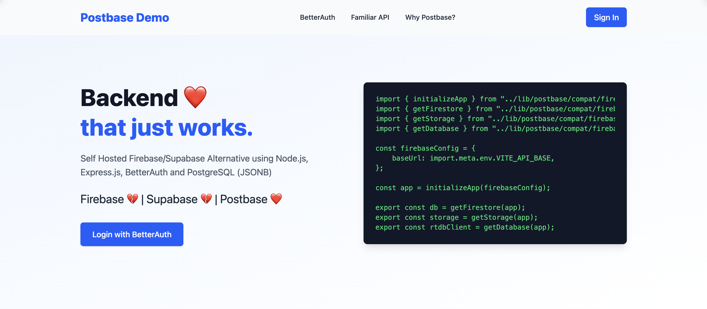

[](https://buymeacoffee.com/umrashrf)



    

# Postbase

Drop-in replacement for Firebase, production grade, open source, localhost first and self-hosted using Node.js, Express.js, BetterAuth and PostgreSQL (JSONB)

Firebase 💔 | Supabase 💔 | Postbase ❤️

Demo Preact app is included !

## Features

### Authentication Features

- [x] Sign Up ➕👤
- [x] Sign In 🔑
- [x] Sign in with Google/Facebook/Apple etc. ➕👤
- [x] Forgot Password ❓🔐
- [x] Reset Password ♻️🔐
- [x] Email Verification Email ✉️✔️
- [x] Phone Verification Codes 📱✔️
- [x] Delete User 👤❌

Special thanks to [@better-auth/better-auth](https://github.com/better-auth/better-auth)

### Database Features

- [x] NoSQL Document Storage 🗄️
- [x] Collections 📁
- [x] Query functions 🔍
- [x] CRUD Functions 🛠️
- [x] Security Rules 🛡️
- [x] Database Migrations 🛢️ → 🛢️

### File Upload / Storage

- [x] File Upload (https) 📄⬆️
- [x] File Serving (https) 📄⬇️
- [x] Security Rules 🛡️

### Admin & System

- [x] Admin SDK 👑🗄️
- [x] Nginx Config 🧱
- [x] Systemd Service ⚙️
- [x] Git Push Deployment ⬆️🐙

## Disclaimer !!!

Brand new project launched 02 Nov 2025, this is boiler plate but working! Expect heavy changes coming every few hours until stable

Mostly all code is ChatGPT generated but manually tested by human.

## Getting Started

To create a new project with Postbase, all you have to do is clone this repo.

```
git clone https://github.com/umrashrf/postbase.git
```

then start backend and frontend servers and modify as needed!

Both backend/ and frontend/ folders have their own README.md

## Vision

Make a drop-in replacement library for Firebase (keep same naming convention). So users can switch between Firebase and Postbase as they please.

## Docs

### Getting Started

```javascript
import { initializeApp } from "../lib/postbase/compat/firebase/app";
import { getFirestore } from "../lib/postbase/compat/firebase/firestore/lite";
import { getStorage } from "../lib/postbase/compat/firebase/storage";
import { getDatabase } from "../lib/postbase/compat/firebase/database";

const firebaseConfig = {
    baseUrl: import.meta.env.VITE_API_BASE,
};

const app = initializeApp(firebaseConfig);

export const db = getFirestore(app);
export const storage = getStorage(app);
export const rtdbClient = getDatabase(app);
```

### Authentication (Firebase Like API)

#### Sign Up

```javascript
import { getAuth, createUserWithEmailAndPassword } from "./auth";

const auth = getAuth();

const userCredential = await createUserWithEmailAndPassword(auth, 'email', 'password');
```

#### Sign In

```javascript
import { getAuth, signInWithEmailAndPassword } from "./auth";

const auth = getAuth();

const userCredential = await signInWithEmailAndPassword(auth, 'email', 'password');
```

#### auth.onAuthStateChanged, auth.currentUser and auth.currentUser.getIdToken()

```javascript
import { auth } from './auth';

auth.onAuthStateChanged(user => {
    // user
    auth.currentUser === user // true
});

const token = auth.currentUser.getIdToken();
// token for API authentication and rules engine
```

Tip: Add this link https://email.riamu.io to your Sign Up page for your users to get a free email address

### Document Storage (Firestore Like API)

#### Collections, get/set/where/orderBy/limit/delete

```javascript
import { db } from "./postbase";

const data = await db.collection('users').doc('docId').get();
// getDoc(collection(db, 'users'), 'docId')

await db.collection('users').set({ name: "Umair" }, { merge: true });
// getDoc(collection(db, 'users'), 'docId')

const reference = db.collection('users')
    .where('name', '==', 'Umair')
    .orderBy('createdAt')
    .limit(5);
// const reference = getDocs(query(collection(db, 'users'), where('name', '==', 'Umair'), orderBy('createdAt')))

const docs = await reference.get();
// const docs = await getDocs(reference);

reference.onSnapshot(docs => {
    // use docs
});
// onSnapshot(reference, docs => {
// 
// })
```

#### Admin Client

```javascript
import { createAdminClient } from './lib/postbase/compat/admin.js';
import { authClient } from './admin/auth.js';

const admin = createAdminClient({ authClient });

const user = await admin.auth().getUser(userId);

const doc = await admin.firestore().collection('collection').doc('docId').get();
```

### Todo
- [ ] Firebase Functions Replacement (Backend API can be used for now)

Important functions to replicate:

```
# https://firebase.google.com/docs/functions/schedule-functions
const { onSchedule } = require("firebase-functions/scheduler");

# https://firebase.google.com/docs/functions/callable
const { onCall } = require("firebase-functions/https");

# https://firebase.google.com/docs/functions/get-started
const { onRequest } = require("firebase-functions/https");
```

- [ ] Firebase Storage Replacement (Support S3 and other backend)

### In Progress
- [ ] Testing

### Done
- [x] Firebase Authentication Replacement
- [x] Firebase Firestore Replacement
- [x] Firebase Storage Replacement (Filebased Only)
- [x] Firebase Storage Replacement (HTTPS Based Upload)

## License 

MIT
